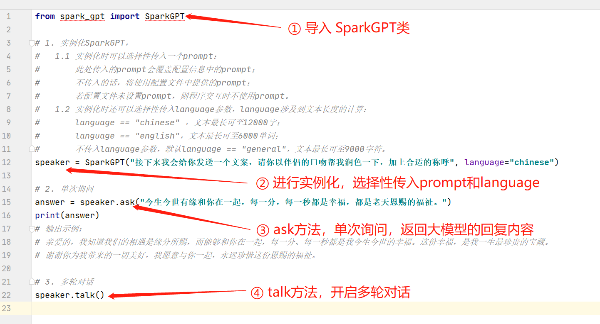
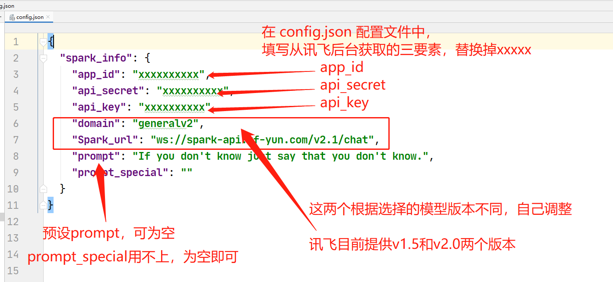
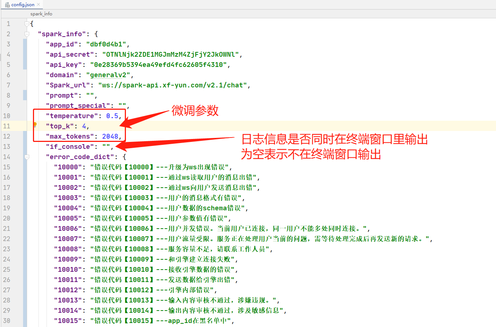
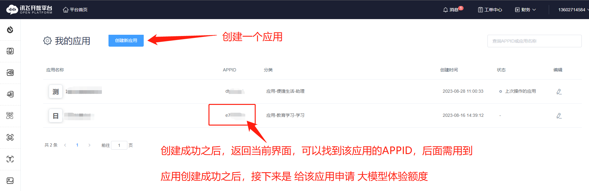
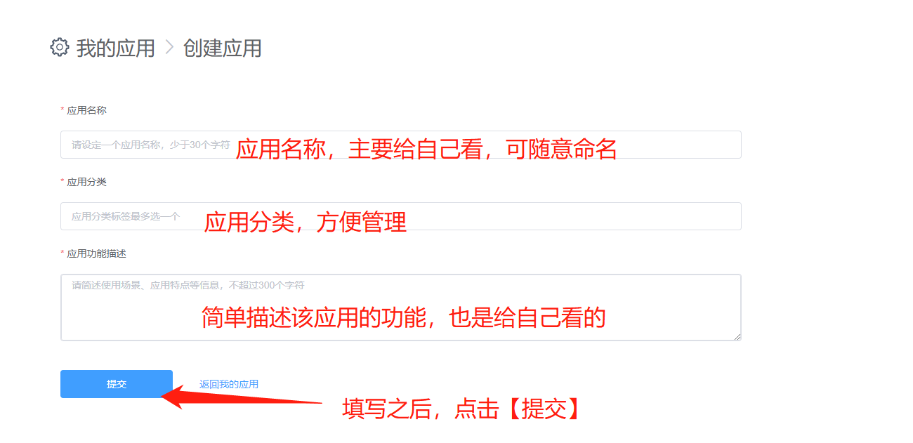
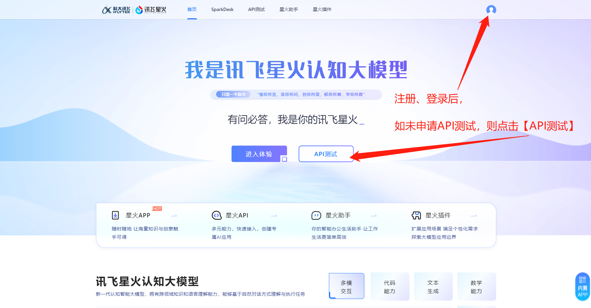
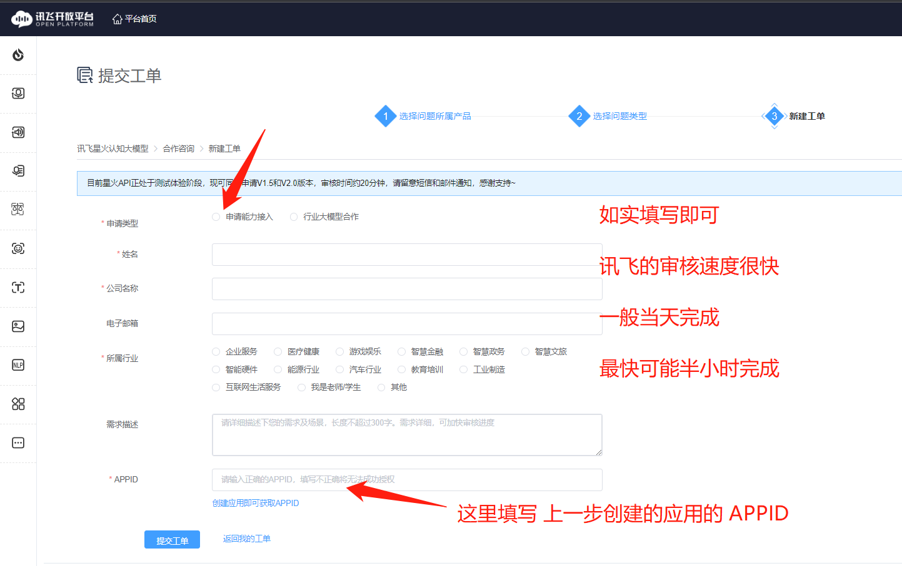
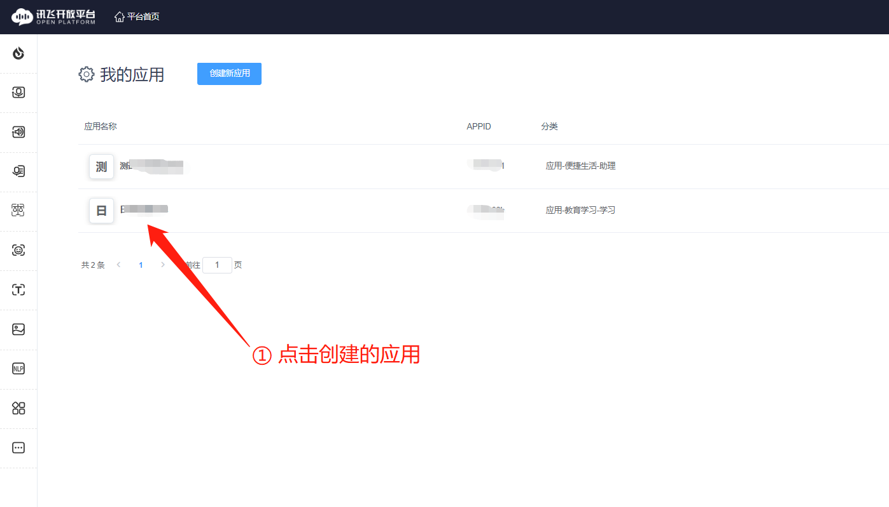
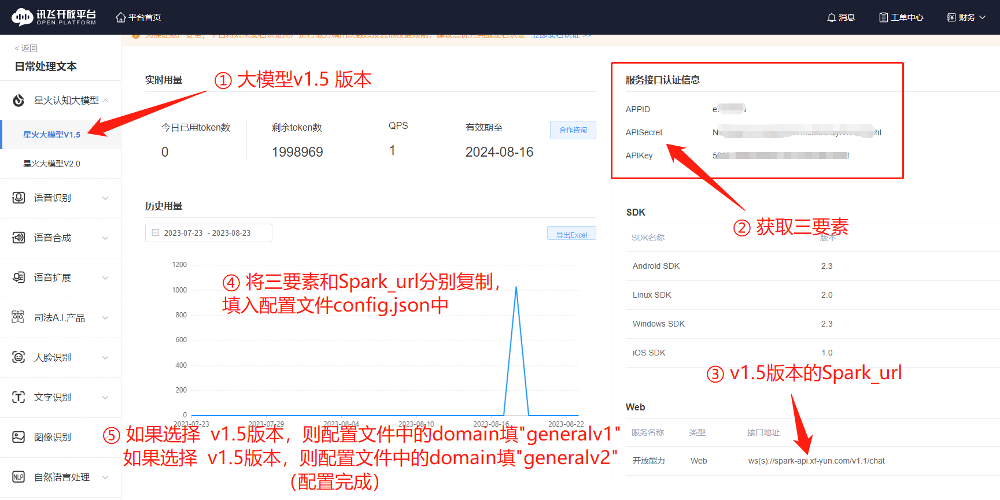
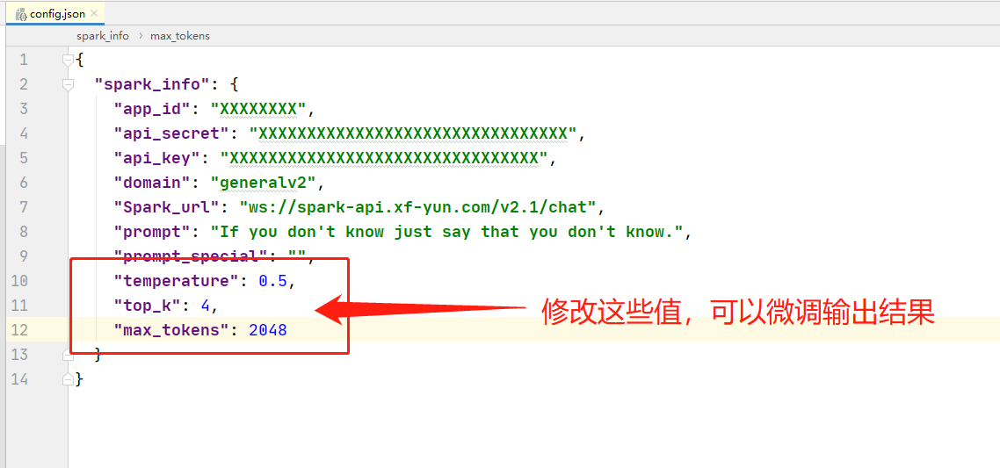

# 讯飞星火大模型 API 封装

## 01 说明

自ChatGPT火了之后，国内的大模型发展如雨后春笋。

**讯飞星火大模型**是国内排名靠前的一款，而且官方提供的API调用也比友商大度，

申请通过后直接是四百万个tokens的**免费额度**。

> `V1.5` 版本的二百万tokrn + `V2.0` 版本的二百万token。
>
> 官方文档中提到：讯飞的token计算，1tokens 约等于1.5个中文汉字 或者 0.8个英文单词。
>
> 所以总量相当于六百万字的中文文本交互。

但是官方提供的API调用示例太过简陋了，没有错误码与错误信息提示，没有tokens的计算功能，

以体验为主，仅支持多轮会话窗口。

操作起来对新手并不友好。

本项目对其 `python版的调用示例` 进行封装，以方便编程小白使用。

项目中包含  `official_demo` 和  `spark_api` 两个文件夹，前者为官方调用示例（2023-08-24），供学习使用；后者即为封装版。

## 02 使用示例

```python
from spark_gpt import SparkGPT

# 1. 实例化SparkGPT，
#   1.1 实例化时可以选择性传入一个prompt：
#       此处传入的prompt会覆盖配置信息中的prompt；
#       不传入的话，将使用配置文件中提供的prompt；
#       若配置文件未设置prompt，则程序交互时不使用prompt。
#   1.2 实例化时还可以选择性传入language参数，language涉及到文本长度的计算：
#       language == "chinese" ，文本最长可至12000字；
#       language == "english"，文本最长可至6000单词；
#       不传入language参数，默认language == "general"，文本最长可至9000字符。
speaker = SparkGPT("接下来我会给你发送一个文案，请你以伴侣的口吻帮我润色一下，加上合适的称呼", language="chinese")

# 2. 单次询问
answer = speaker.ask("今生今世有缘和你在一起，每一分，每一秒都是幸福，都是老天恩赐的福祉。")
print(answer)
# 输出示例：
# 亲爱的，我知道我们的相遇是缘分所赐，而能够和你在一起，每一分、每一秒都是我今生今世的幸福。这份幸福，是我一生最珍贵的宝藏。
# 谢谢你为我带来的一切美好，我愿意与你一起，永远珍惜这份恩赐的福祉。

# 3. 多轮对话
speaker.talk()
```



> 配置相关：
>
> `实例.app_id` ： 返回app_id。
>
> `实例.api_key` ： 返回api_key。
>
> `实例.api_secret` ： 返回api_secret。
>
> `实例.domain` ： 返回domain。在目前（2024-08-24）版本中，官方只提供 "generalv1" 和 "generalv2"。
>
> `实例.Spark_url` ： 返回Spark_url。在目前（2024-08-24）版本中，官方只提供 "ws://spark-api.xf-yun.com/v1.5/chat" 或者 "ws://spark-api.xf-yun.com/v2.1/chat"。
>
> （注意：domain参数需要和Spark_url搭配）
>
> `实例.max_tokens` ： 返回max_tokens。默认为2048，模型回答的tokens的最大长度，即允许它输出文本的最长字数。
>
> `实例.temperature` ： 返回temperature。取值为[0,1],默认为0.5。取值越高随机性越强、发散性越高，即相同的问题得到的不同答案的可能性越高。
>
> `实例.top_k` ： 返回top_k。取值为[1，6],默认为4。从k个候选中随机选择一个（非等概率）
>
> （注意：temperature和top_k都涉及到回答的随机性，官方建议，修改随机性时，修改其中一个即可。）
>
> `实例.prompt` ： 返回实例的prompt。
>
> `实例.text` ： 返回列表，存储当前实例的历史会话信息。
>
> `实例.all_answers_data` ： 返回当前实例所有答案的流式信息。
>
> `实例.prompt` ： 返回实例的prompt。
>
> ---
>
> token计算相关：
>
> `实例.this_tokens` ： 返回最新一次交互中，消耗的tokens总数
>
> `实例.this_answer_tokens` ： 返回最新一次交互中，回答部分的tokens数
>
> `实例.this_question_tokens` ： 返回最新一次交互中，问题部分的tokens数，在多轮会话中，也是累计问题tokens数
>
> `实例.all_tokens` ： 返回累计消耗tokens总数
>
> ---
>
> 方法相关：
>
> `实例.set_max_tokens(value)` ： 修改当前实例的max_tokens
>
> `实例.set_top_k(value)` ： 修改当前实例的top_k
>
> `实例.set_temperature(value)` ： 修改当前实例的temperature
>
> `实例.set_language(value)` ： 修改当前实例的language，可传入`chinese`或`english`，该值主要涉及输入文本最大长度计算。
>
> `实例.reset_text()` ： 重置历史会话记录
>
> `实例.ask(self, question)` ： 接收一个问题，返回sparkGPT的回复。
>
> `实例.talk()` ： 开启多轮会话。
>
> `实例.get_text()` ： 返回一个列表，元素为字典。内容为对话记录。
>
> `实例.get_answer()` ： 返回最新一次交互的答案

## 02 官方API的申请与使用

### 2.1 使用前需先配置信息

在config_demo.json中修改 app_id, api_secret, api_key三个值，

然后将`config_demo.json`重命名为`config.json`。



**2023-08-28 更新**：配置文件中新增了微调参数设置，日志控制设置与错误码信息。

> 在此处修改微调参数，请确保其符合官方文档要求。详见下方【一些参数说明】




### 2.2 配置信息详细步骤

第一步：登录讯飞后台：[讯飞星火认知大模型](https://xinghuo.xfyun.cn/)

> 如果没有账号，则需先注册、


第二步：创建一个应用。





第三步：返回首页[讯飞星火认知大模型](https://xinghuo.xfyun.cn/)，申请讯飞星火认知大模型的API测试权限。






第四步：等待官方通过申请。然后点击 你创建的应用，再点击左侧的【星火认知大模型】



第五步：获取认知三要素，配置文件中的 `Spark_url` 也在此页获取。



第六步：将获取到的信息填入配置文件中。然后将`config_demo.json`重命名为`config.json`。


### 2.3 使用步骤

#### 2.3.1 第一步：下载代码

可以拉取GitHub的项目代码。

```bash
git clone git@github.com:zibuyu2015831/xfyun-spark-api.git
```

也可以从本人的公众号获取。

**关注【思维兵工厂】，回复“星火大模型”。**有使用问题，也可到公众号与我联系。

（不建议从其他渠道获取，以防有心之人修改了代码，以致泄露信息的情况。）


#### 2.3.2 第二步：安装必要依赖

```bash
pip install -r requirements
```

其实，只用到了一个第三方包： `websocket_client` 。用下面的命令也可以：

```bash
pip install websocket_client
```

(关于websocket_client的版本，官方没作要求。我使用的是1.5.2版本。)

#### 2.3.3 导入使用

（后期可能更新一些使用案例）

## 03 使用注意

在官方文档的说明中，访问的token需要控制在8192内。

> 而token字符的换算，根据官方给出的数据，1 token = 约等于1.5个中文汉字 或者 0.8个英文单词。

也就是说：

- 单次调用（即上图调用 `speaker.ask()` 方法），文本最大长度为 **1.2万个中文汉字** 或者 **6千个单词**。
- 多轮会话（即上图调用 `speaker.talk()` 方法），类似汉字（包括问题与答案）最多1.2万。超过1.2万字将逐渐丢失上下文语境。

## 04 一些参数说明

微调大模型的输出结果，是通过修改请求头的某些参数实现的。

具体来说，在配置文件 `config.json` 中，后三个值，可以修改，以微调输出结果。



参数修改请参考官方表格：

| 参数名称    | 类型   | 必传 | 参数要求                   | 参数说明                                                     |
| ----------- | ------ | ---- | -------------------------- | :----------------------------------------------------------- |
| domain      | string | 是   | 取值为[general,generalv2]  | 指定访问的领域,general指向V1.5版本 generalv2指向V2版本。注意：不同的取值对应的url也不一样！ |
| temperature | float  | 否   | 取值为[0,1],默认为0.5      | 核采样阈值。用于决定结果随机性，取值越高随机性越强即相同的问题得到的不同答案的可能性越高 |
| max_tokens  | int    | 否   | 取值为[1,4096]，默认为2048 | 模型回答的tokens的最大长度                                   |
| top_k       | int    | 否   | 取值为[1，6],默认为4       | 从k个候选中随机选择⼀个（⾮等概率）                          |
| chat_id     | string | 否   | 需要保障用户下的唯一性     | 用于关联用户会话                                             |

注意，在官方早期的demo中，可能会出现 `random_threshold参数` 和 `auditing参数` ，但官方文档(2023-08-24)中并未说明。

经过咨询对方技术人员， `auditing参数` 为输入输出的审核参数，当前是默认值；`random_threshold参数` = `temperature`。

详细请参照官方文档：[科大讯飞 (xfyun.cn)官方文档](https://www.xfyun.cn/doc/spark/Web.html#_1-%E6%8E%A5%E5%8F%A3%E8%AF%B4%E6%98%8E)

## 05 关于tokens消耗的测试

以下是一次多轮会话的tokens消耗数据：

---

第一次交互：

> 问：请你根据你掌握的历史回答我的问题，如果你不知道就说不知道。秦始皇的真名是什么？
>
> 答：秦始皇的真名是赢政。

本次问答tokens数： 53
本次问题tokens数： 44
本次答案tokens数： 9

累计问题tokens数： 44
累计消耗tokens数： 53

---

第二次交互：

> 问：秦始皇出名的儿子都有谁？
>
> 答：秦始皇有十八个儿子，但其中比较出名的只有两位：扶苏和胡亥。扶苏是秦始皇的长子，但其性格温和、仁爱，不似秦始皇那般强势，因此并没有得到秦始皇的宠爱。而胡亥则是秦始皇的小儿子，在秦始皇死后继位，但不久就被赵高等人所杀。

本次问答tokens数： 139
本次问题tokens数： 68
本次答案tokens数： 71

累计问题tokens数： 68
累计消耗tokens数： 192

---

第三次交互：

> 问：秦始皇死的那天早上，早餐吃了什么？
>
> 答：关于秦始皇死的那天早上他吃了什么，历史上并没有明确的记载。不过根据一些文献和传说，有几种说法认为他当天早上可能吃了粗粮和蔬菜做的粥，以及蒸鱼、烤肉等食物。但这些都只是猜测，无法确定其真实性。

本次问答tokens数： 212
本次问题tokens数： 156
本次答案tokens数： 56

累计问题tokens数： 156
累计消耗tokens数： 404

---

第四次交互：

> 问：秦始皇灭六国统一天下，哪一个国家是秦始皇最后消灭的？
>
> 答：秦始皇灭六国统一天下的过程中，最后一个被消灭的国家是韩国。秦始皇先后击败了赵国、魏国、楚国、燕国和齐国，最终只剩下韩国没有被征服。秦始皇派遣王贲率领大军进攻韩国，经过三年的战争，最终于公元前230年攻陷韩国都城新郑，使韩国成为秦国的附属国。随后，秦始皇将韩国的领土划分为三十个郡，设立秦韩两郡，标志着中国历史上第一次大一统王朝——秦朝的建立。

本次问答tokens数： 340
本次问题tokens数： 236
本次答案tokens数： 104

累计问题tokens数： 236
累计消耗tokens数： 744

---

第五次交互：

> 问：哪一个国家是他最先消灭的？
>
> 答：秦始皇最先消灭的国家是赵国。在秦灭六国的过程中，秦始皇采取了先易后难、各个击破的策略，而赵国是他攻打的第一个国家。公元前230年，秦始皇派遣将军王翦率领大军进攻赵国都城邯郸，经过一年多的战斗，最终于公元前225年攻陷邯郸，使赵国成为秦国的附属国。此后，秦始皇又先后击败了魏国、楚国、燕国和齐国，最终统一天下建立了秦朝。

本次问答tokens数： 455
本次问题tokens数： 356
本次答案tokens数： 99

累计问题tokens数： 356
累计消耗tokens数： 1199

---


第六次交互：

> 问：替秦始皇征战的将军都有谁？
>
> 答：秦始皇统一天下的过程中，派遣了众多的将领和名将征战四方，其中一些比较出名的将军包括：
>
> 1. 李斯：秦国重要的政治家和谋士，也是秦始皇身边的得力干将，替秦始皇拟定了许多重要的政策和法律。
> 2. 王翦：秦国重要的将领之一，替秦始皇征战六国，先后击败了赵国、魏国等国。
> 3. 蒙恬：秦国重要的将领之一，替秦始皇征战北方，曾多次打败匈奴等外族。
> 4. 章邯：秦国将领，曾替秦始皇攻打赵国，后来在楚汉战争中投降了刘邦。
> 5. 项羽：虽然项羽并非秦始皇时期的将领，但他是秦末时期的重要人物之一，替秦朝东征西讨，最终推翻了秦朝的统治。

本次问答tokens数： 644
本次问题tokens数： 472
本次答案tokens数： 172

累计问题tokens数： 472
累计消耗tokens数： 1843

---

第七次交互：

> 问：这些将军中，哪一个的历史结局比较好？
>
> 答：这些将军中，历史结局比较好的可能是王翦。王翦替秦始皇征战六国，先后击败了赵国、魏国等国，是秦国的一位重要将领。在秦始皇死后，他的儿子王贲继续为秦朝效力，成为重要的官员和军事将领。而其他一些将军，如蒙恬、章邯等，在秦始皇死后不久就被指控谋反，被迫自杀或被处死。项羽则是在秦末时期崛起的一位将领，虽然他曾经替秦朝东征西讨，但最终却与刘邦结盟，成为了汉朝的开国皇帝。

本次问答tokens数： 780
本次问题tokens数： 662
本次答案tokens数： 118

累计问题tokens数： 662
累计消耗tokens数： 2623

---------------------------------

累计消耗tokens：2623

根据官方目前的计费标准（2023-08-24）：

使用v2.0版本费用为：0.83936 元
使用v1.5版本费用为：0.41968 元

---

结论：

从累计消耗tokens数与大模型底层逻辑来看，大模型其实不适合多轮会话，所谓多轮会话，是将重复输入前面的问题，以便让大模型了解语义。

以上面的例子来说，第七次交互时，是将前六次的问题合并到第七次的问题中，在输入给大模型。

因此，多轮会话的交互次数越多，对tokens的消耗就越快。

从上面可以看到，

第一个问题消耗的tokens数为44，第七个问题的tokens消耗就高达2623，大概是第一个问题的60倍。


